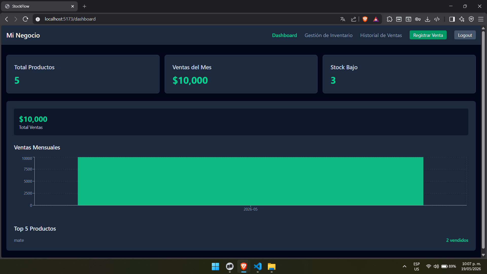
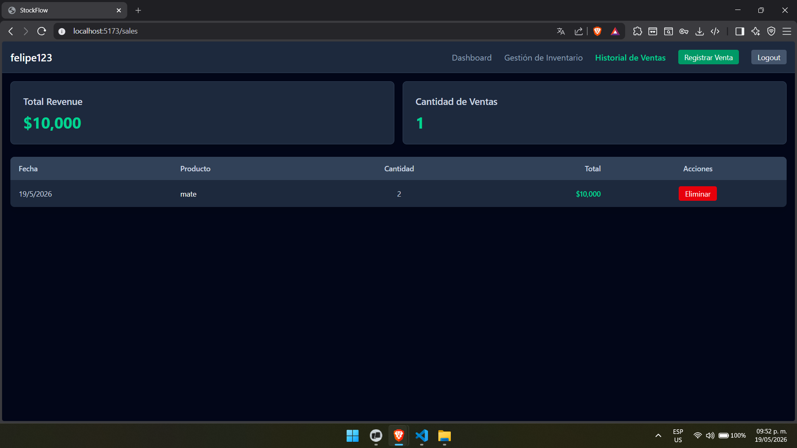
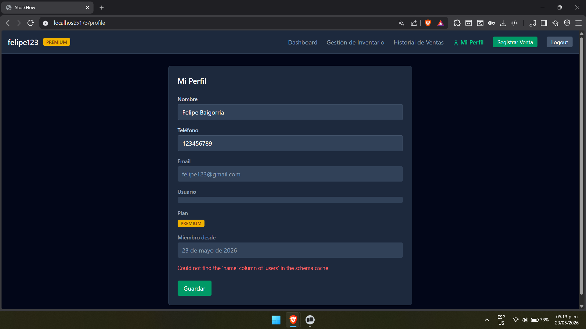
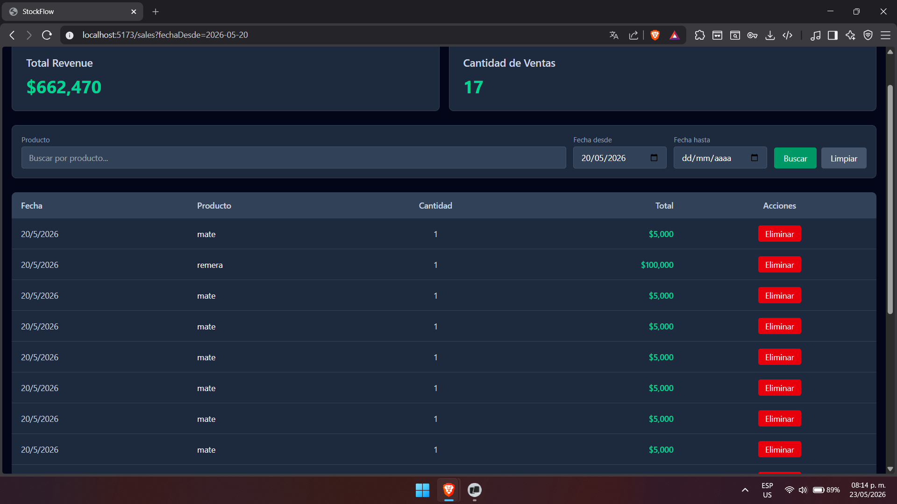

# StockFlow — Sistema de Gestión de Inventario

StockFlow es una aplicación web moderna para la gestión de inventario, diseñada para pequeños y medianos negocios. Ofrece un catálogo público, control de stock, registro de ventas y reportes en tiempo real.

## 🚀 Características

### Core
- ✅ Autenticación de usuarios con Supabase
- ✅ CRUD completo de productos con imágenes
- ✅ Catálogo público por username (`/:username/catalog`)
- ✅ Flujo de ventas con decremento automático de stock
- ✅ Dashboard con métricas reales y gráficos
- ✅ Historial de ventas con paginación
- ✅ Reporte de ventas mensual y top productos

### Planes FREE / PREMIUM
- ✅ **FREE**: hasta 20 productos
- ✅ **PREMIUM**: productos ilimitados
- ✅ Upgrade modal con información de contacto

### Funcionalidades avanzadas
- ✅ Perfil de usuario editable (nombre, teléfono)
- ✅ Búsqueda y filtros en productos (nombre, categoría, precio)
- ✅ Búsqueda en historial de ventas (producto, rango de fecha)
- ✅ Persistencia de filtros en URL
- ✅ Navbar responsive con badge de plan

## 🛠️ Stack Tecnológico

| Capa | Tecnología |
|------|-----------|
| **Frontend** | React 19 + TypeScript 6 |
| **Build tool** | Vite 8 |
| **Estilos** | Tailwind CSS 4 |
| **Estado** | Zustand 5 |
| **Routing** | React Router 7 |
| **Backend** | Supabase (PostgreSQL + Auth + Storage) |
| **Gráficos** | Recharts 3 |

## 📸 Capturas de pantalla

### Dashboard
Panel principal con métricas clave (total productos, ventas del mes, stock bajo) y gráfico de ventas mensuales.



### Historial de Ventas
Listado completo de ventas con opción de eliminar registros.



### Perfil de Usuario
Edición de datos personales, visualización del plan (FREE/PREMIUM) y fecha de registro.



### Búsqueda y Filtros en Ventas
Filtrado de ventas por nombre de producto y rango de fechas, con persistencia en URL.



### Catálogo Público
*(Agregar captura cuando tengas)*
Tienda pública accesible sin autenticación para los clientes.

### Gestión de Productos
*(Agregar captura cuando tengas)*
Listado de productos con opciones de edición, eliminación y registro de ventas.

## 📦 Instalación

### Requisitos previos
- Node.js 20+
- npm o pnpm
- Cuenta de Supabase

### Pasos

```bash
# Clonar el repositorio
git clone https://github.com/tu-usuario/stockflow.git
cd stockflow

# Instalar dependencias
npm install

# Configurar variables de entorno
cp .env.example .env
# Editar .env con tus credenciales de Supabase

# Iniciar en modo desarrollo
npm run dev

# Build para producción
npm run build
